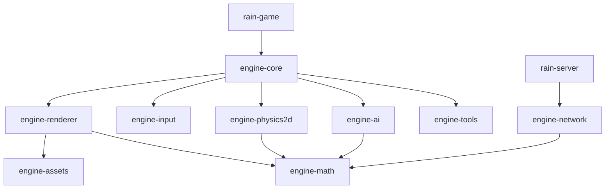
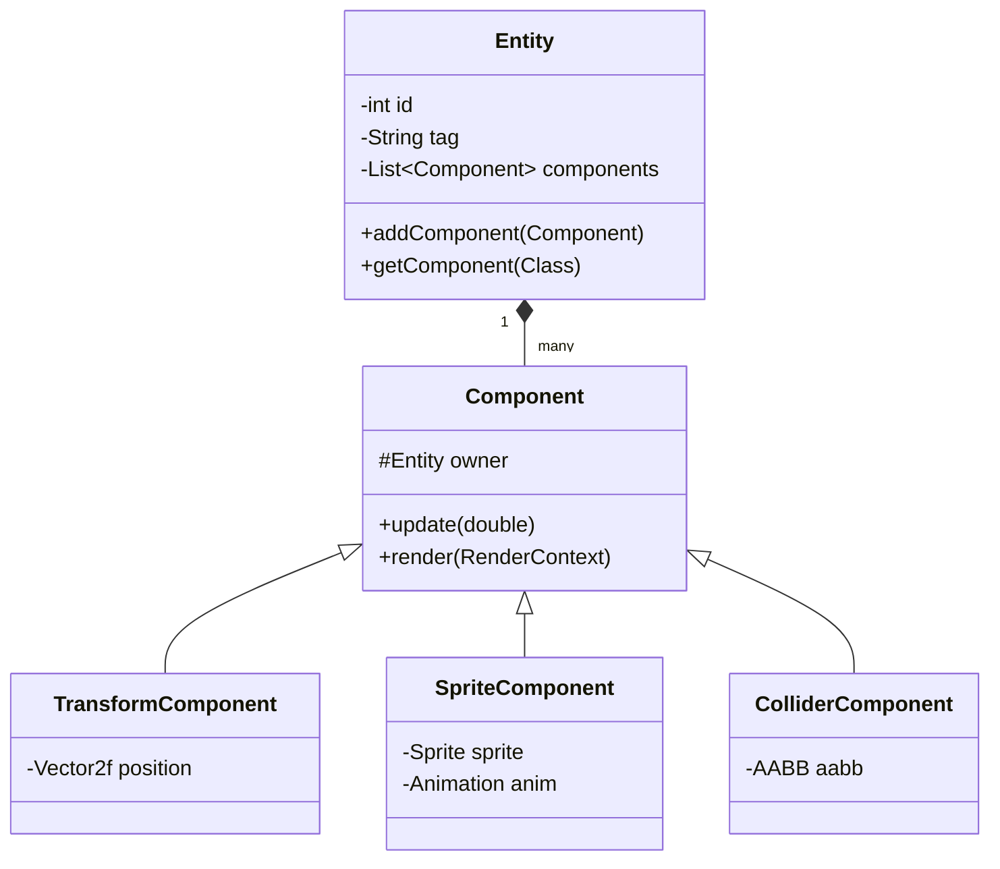

# Engine Architecture

This document details the architectural decisions and modules of **Rain Remastered**, explaining the relationships between engine subsystems and the separation between engine and game logic.

---

## 1. Modular Overview

The project relies on a modular **Gradle multi-module** setup to enforce dependency boundaries. High-level modules do not have direct dependencies on details of lower-level modules:



---

## 2. Decoupled Rendering Context

In a typical software renderer (like the original series), pixel-pushing is coupled with AWT buffers. In Rain Remastered, we introduced `RenderContext` and `SoftwareRenderContext` abstractions:

```java
public interface RenderContext {
    void clear(int color);
    void drawSprite(int x, int y, Sprite sprite, boolean useCamera);
    // ...
}
```

By decoupling draw commands from buffers, we can implement an hardware-accelerated backend (e.g. OpenGL/Vulkan via LWJGL) simply by writing a class implementing `RenderContext`, without modifying a single line of game entities or tile rendering logic.

---

## 3. ECS-Lite Component Composition

Instead of subclassing `Mob` and `Entity` to add health or movement characteristics, we implement a composition model where entities contain component bags:

* **Entity**: Wraps unique identity IDs and holds dynamic component arrays.
* **Component**: Base lifecycle container.
* **TransformComponent**: Defines position coords.
* **MovementComponent**: Handles velocity and slides collider checks against `TileMap` borders.
* **ColliderComponent**: Wraps bounds box (`AABB`).



---

## 4. Asynchronous Threaded AI

A* Pathfinding utilizes `NavigationGrid`, decoupling it from the concrete `TileMap` implementation. To prevent path calculations from stalling the main game thread, we query paths from background threads, making sure calculations run asynchronously.
